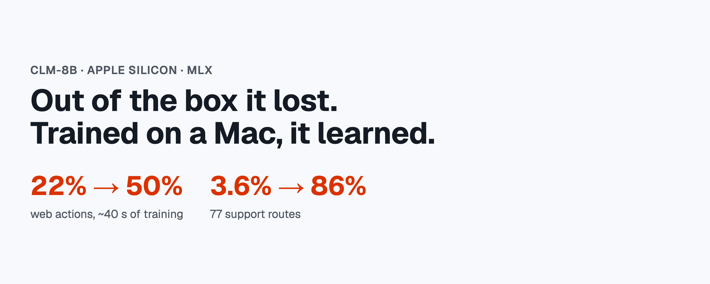
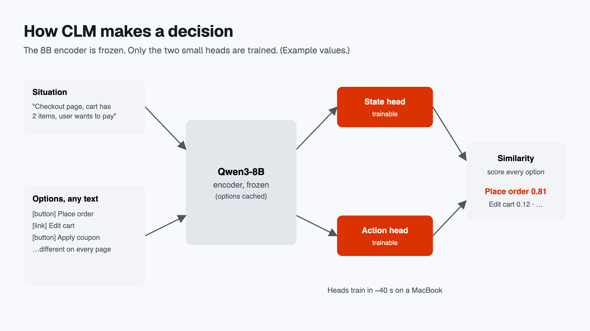
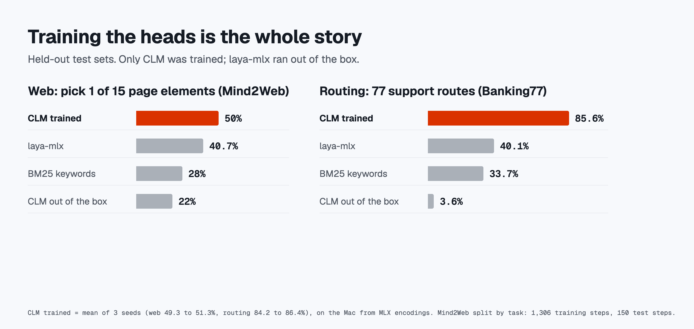
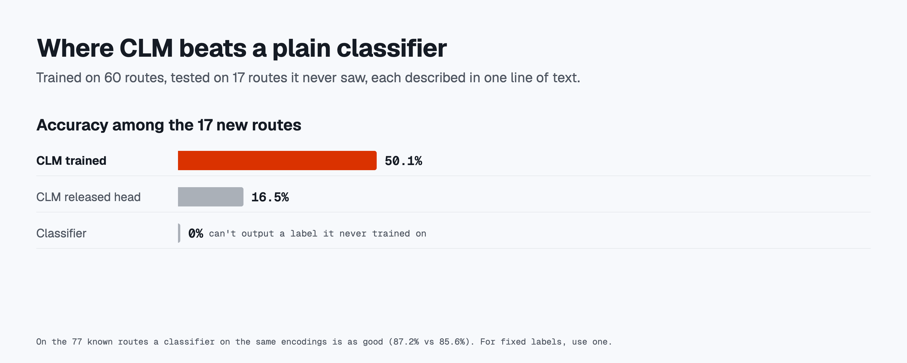
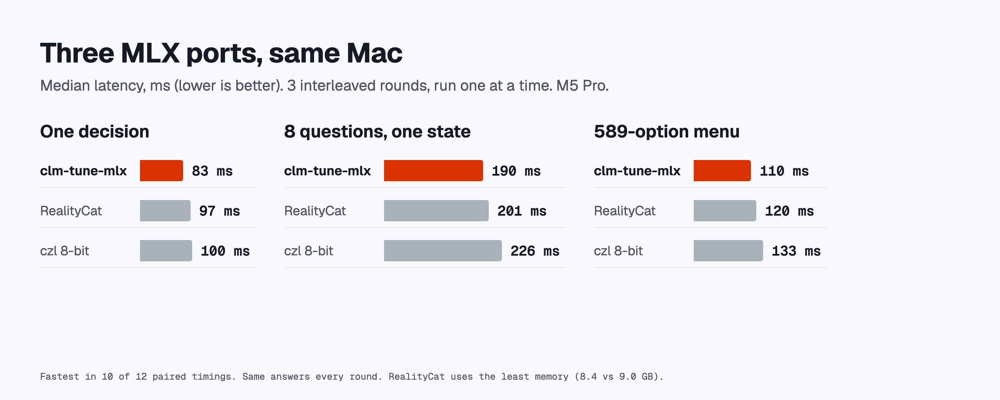

# clm-tune-mlx: train CLM-8B on Apple Silicon

**CLM-8B on Apple Silicon, with a measured answer to what it's good for.**



CLM is a new kind of decision model: it scores a situation against a list of possible actions, where each action is plain text. I ported it to Apple's MLX so it runs on a Mac, then tested it on more than 4,000 labeled decisions against laya-mlx and keyword search. Out of the box it lost almost every test. Trained for under a minute on my MacBook, it learned to rank options that change on every request, well enough to pass the local alternative.

## 1. What CLM is best at

**Learning, on a laptop, to rank options that change on every request.**

A normal classifier needs a fixed list of labels. Real agent decisions often don't have one: every web page has different buttons, every user has different tools, every search returns different documents. CLM scores any list of text options, and its small heads can be trained on your own examples in seconds, because its 8B encoder stays frozen.



The evidence, all on held-out data:

| Test | CLM out of the box | **CLM trained on a Mac** | laya-mlx | BM25 keywords |
|---|---:|---:|---:|---:|
| Web: pick the next page element among 15 (Mind2Web, different elements every step) | 22.0% | **49.3 to 51.3%** | 40.7% | 28.0% |
| Routing: 77 support routes (Banking77) | 3.6% | **84.2 to 86.4%** | 40.1% | 33.7% |
| Routing: messages from 17 routes it never trained on | 16.5% | **50.1%** | | |



- **Web actions** is the result that matters most. Trained on 1,306 steps from other tasks (8.3 minutes to encode once, about 40 seconds to train), CLM more than doubled and passed laya-mlx and keyword search. A classifier can't run this test at all: there's no fixed label set.
- **How the web test works.** Each step tells the model which operation comes next, and the model picks which element on the page to do it on (Mind2Web's element-selection setup). 126 of the 150 steps are clicks, where it only sees the word CLICK. The other 24 are typing or dropdown steps, where it also sees the value (for example "TYPE: New York"). Every model got the same input. So this measures finding the right element, not deciding the next action from scratch.
- **Routing** shows how fast the heads learn. Here a plain classifier on the same frozen encodings does about as well (87.2%), so for fixed labels, use one. CLM's edge is the next row: it can take a route it never trained on, described in one line of text. A classifier scores 0% by construction.


- **Speed doesn't grow with the menu.** Options are encoded once and cached: 80 ms per decision with 10 options, 89 ms with 589 (8-bit).

What it isn't: tested against every alternative. laya-mlx never got a training pass here; Laya can be fine-tuned too, and I didn't test that. On fixed-label routing a plain classifier on the same encodings matches CLM trained (87.2% vs 84.2 to 86.4%), so the case for CLM is options that change or that it never trained on.

## Get it: the MLX build

This repo runs CLM-8B on Apple Silicon entirely in MLX: the Qwen3-8B encoder and the released heads (weights unchanged, converted to safetensors), no PyTorch needed. 118 of 120 decisions identical to the PyTorch original (bf16); the MLX heads match the PyTorch heads on 120 of 120. What it adds on top: head training on a Mac, a micro-batching typed-decision server, and the benchmarks in this README. Build on it. Model card: [huggingface.co/abe238/clm-tune-mlx](https://huggingface.co/abe238/clm-tune-mlx).

Other MLX conversions appeared the same week, each with its own parity checks: [czl/CLM-v0.1-8B-MLX](https://huggingface.co/czl/CLM-v0.1-8B-MLX) (bf16 to 4-bit) and [RealityCat/CLM-v0.1-8B-MLX-8bit](https://huggingface.co/RealityCat/CLM-v0.1-8B-MLX-8bit). This package was renamed from `clm_mlx` to `clm_tune_mlx` so it installs alongside RealityCat's `clm_mlx`.

**Head-to-head, same Mac (M5 Pro), same 8-bit weights for ours and RealityCat, 3 interleaved serial rounds:**

| | clm-tune-mlx | RealityCat | czl 8-bit |
|---|---:|---:|---:|
| One decision, p50 | **83 ms** | 97 ms | 100 ms |
| Eight questions on one state | **190 ms** | 201 ms | 226 ms |
| 589-option menu, p50 | **110 ms** | 120 ms | 133 ms |
| Load time | **1.9 s** | 3.5 s | 3.0 s |
| Peak memory | 9.0 GB | **8.4 GB** | 8.9 GB |
| Typed decisions (120) | 50.8% | 50.8% | 55.0% |

Ours was fastest in 10 of 12 paired timings; margins are small (3 to 15%). Accuracy is the same model: every port gave identical answers in all three rounds. czl's higher score comes from its different 8-bit rounding flipping 8 near-tie answers (top two options within 0.03 to 0.17), 5 of them the right way. It even beats bf16 (51.7%), so read it as luck, not a better model. The accuracy lever none of the ports have is below: training the heads.



```bash
pip install git+https://github.com/abe238/clm-tune-mlx      # mlx-lm + numpy only, no PyTorch (~320 MB env)
pip install "clm-tune-mlx[torch] @ git+https://github.com/abe238/clm-tune-mlx"  # adds PyTorch, only for upstream .pt heads and the reference engine
```

```python
from clm_tune_mlx import load_engine

engine = load_engine()                       # 8-bit encoder, ~8 GB; load_engine("Qwen/Qwen3-8B") for bf16
out = engine.answer(
    {"ticket": "I was billed twice. Please refund the duplicate."},
    {"money": {"type": "noul", "instructions": "Is `ticket` about a payment problem?"}},
)
print(out["answers"])
```

**Train your own heads.** Training is pure MLX (`mlx.nn` + `mlx.optimizers`), no PyTorch. It follows the recipe of the PyTorch trainer in `benchmark/finetune/ft_train.py`: warm start from the released head, normalized state and action projections, trained logit scale (capped at 100), cross-entropy over the options, AdamW, early stopping on a validation split. The encoder runs once per example and is cached; training itself uses the cached vectors.

```bash
# data.jsonl: one {"state": "...", "options": ["a", "b", ...], "label": 0 or "a"} per line
clm-tune-mlx-train data.jsonl --out heads.safetensors --test-frac 0.2 --val-frac 0.1
clm-tune-mlx-serve --heads heads.safetensors
```

It prints and saves (`heads.report.json`) a report card: accuracy on a held-out test split against a majority-class baseline and a BM25 baseline over the option text. If training does not beat the better baseline, the report says "No gain over baselines". From Python, `clm_tune_mlx.train.train_heads` takes precomputed embeddings (one shared option list or a list per example). `benchmark/finetune/ft_train_mlx.py` reruns the Banking77 experiment with it: on all 9,003 training messages the MLX trainer reaches **83.9%** on the 3,080-message test set, against 83.1% for the PyTorch trainer with the same recipe (identical validation accuracy, 0.837), and trains in 7 seconds instead of 18 on an M5 Pro. Results in `ft-results-mlx.json` next to `ft-results.json`. Heads saved by the older PyTorch trainer (`.pt`) still load; that path needs the `torch` extra.

**Serve it** behind a `/v1/systemone`-style typed-decision API with micro-batching:

```bash
clm-tune-mlx-serve --port 8700 --heads your-heads.safetensors   # --encoder Qwen/Qwen3-8B for bf16
```

Any compatible client works by changing its base URL. Requests that arrive while the model is busy share one encoder pass. Apple Silicon, Python 3.10+.

## 2. What it isn't: a replacement for laya-mlx

Out of the box, on the same questions, one MacBook Pro (M5 Pro), one model in memory at a time:

| | CLM-MLX bf16 | laya-mlx fp16 |
|---|---:|---:|
| Typed decisions, 120 hand-labeled | 51.7% | 75.8% |
| Tool choice, 40 options (BFCL) | 64.7% | 86.7% |
| Tool choice, 10 look-alikes | 48.7% | 63.3% |
| Web action, 15 elements | 22.0% | 40.7% |
| T-Rex, courses survived | 0/5 | 5/5 |
| Time per decision | ~70 to 100 ms | ~9 to 16 ms |
| Memory | 15.4 GB (8.3 GB at 8-bit) | 1.4 GB |

laya-mlx is the accuracy leader here, and the fast, light local option, 20x smaller than CLM. CLM's released head is a starting point, not a finished product.

### When to use what

| If you need… | Use |
|---|---|
| Good decisions locally, fast, no training data | **laya-mlx** (9 ms, 1.4 GB) |
| A fixed set of labels and a few thousand examples | **a plain classifier** on a frozen encoder (this repo's MLX encoder works) |
| Options that change every request, and some examples to train on | **clm-tune-mlx, trained heads** |
| To add options later by describing them, without retraining | **clm-tune-mlx, trained heads** |
| To score thousands of options in constant time | **clm-tune-mlx**, but check its ranking against BM25 on your data |
| To run or fine-tune CLM without NVIDIA hardware | **clm-tune-mlx** |

## 3. How I got here

**Is the port right?** Before any accuracy claim, the MLX encoder was checked against PyTorch: minimum cosine 0.99965 (bf16), and 118 of 120 decisions identical through the upstream engine. 8-bit matches 115 of 120; every flip is a case where PyTorch itself was unsure (top probability 0.61 or less). 4-bit fails (81 of 120), so it isn't recommended.

**First pass: general decisions.** On 120 typed questions (yes/no, pick one, rate a level), CLM scored 51.7%. Its PyTorch original scores 52.5%, so that's the model, not the port. The trained heads matter (the encoder alone scores 35%), but out of the box they don't know these tasks.

**Its home turf, agents.** The CLM authors claim parity with commercial systems on computer use, games and tool calling. On tool choice CLM trailed laya-mlx by 15 to 22 points, and on web actions it reached 22%.

**Real time.** On the authors' own T-Rex harness, CLM chose moves about as well as laya-mlx (81 to 84% agreement with the planner) but died by answering late. Tail latency was 233 to 281 ms against laya-mlx's 33 ms. I added micro-batching to the server: survival went from 1/5 to 3/5 (8-bit) and 0/5 to 2/5 (bf16). Five courses per setting is a small sample; read it as direction.

**The retrieval pitch.** A video walkthrough of CLM's design reset the question: CLM is built to shortlist huge menus in constant time, so a slower model can decide. The constant time held (80 to 89 ms from 10 to 589 options). The ranking didn't: plain BM25 put the right tool in its top 10 for 92% of requests vs CLM's 67%, and 32% vs 15% on full web pages.

**The turn: train it.** CLM keeps its encoder frozen, so training its heads is cheap. On Banking77 routing it went from 3.6% to 86% after under a minute of training on the Mac, above laya-mlx's out-of-the-box 40.1% on the same test. Then the obvious objection: a plain classifier on the same encodings does as well (87.2%). So the question became what CLM can do that a classifier can't. Two answers, both measured: options described in text it never trained on (50% vs 0%), and option lists that change every request (web actions, 22% → 50%).

**Caveats I'd want to know.** Trained CLM is compared against untrained Laya. Banking77 and Mind2Web are public, so Qwen3-8B may have seen them. The web test has 150 steps, and the T-Rex runs have 5 courses each.

## Next experiment: a cheap judge for training other models

The CLM authors report that fine-tuned heads pick the best of several coding-agent attempts (DeepSWE 81.6%, Terminal-Bench 87.6%). If that transfers, trained CLM heads become a fast local scorer to filter synthetic data or pick best-of-N samples when training bigger models. Untested here; the two training results above are the evidence that the heads learn quickly on a Mac.

## Reproduce

Everything is in `benchmark/`: frozen question sets with sha256 checks, runners, raw results, and a local report with a live side-by-side tester (`serve.py`). `finetune/` holds the routing experiment, `agentic/` the tool, web, shortlisting and web-training tests, and `trex/` the runs against the authors' harness in [Contrastive-LM/CLM](https://github.com/Contrastive-LM/CLM). laya-mlx pins a different MLX version, so give it its own venv (`pip install laya-mlx==0.2.0`).

| MLX build | bf16 | 8-bit |
|---|---:|---:|
| Same answer as PyTorch CLM (120 cases) | 118/120 | 115/120 |
| One decision, options cached, p50 | 94 ms | 68 ms |
| Eight questions on one state | 191 ms | 176 ms |
| Peak memory | 15.4 GB | 8.3 GB |

## Credits and license

**Independent research.** Not affiliated with or endorsed by Convai Innovations or Contrastive-LM. Results are aggregate measurements of each model's public behavior on the stated test sets, not claims about any product's general quality.


CLM, its engine and the released head: [Contrastive-LM](https://github.com/Contrastive-LM/CLM) (Apache-2.0). Qwen3-8B: Qwen team (Apache-2.0). Laya: Convai Innovations (Apache-2.0); laya-mlx: mizorewww. BFCL: gorilla-llm (Apache-2.0). Mind2Web: OSU NLP Group (CC-BY-4.0). Banking77: PolyAI (CC-BY-4.0). An independent community port, not an official release. Apache-2.0.
